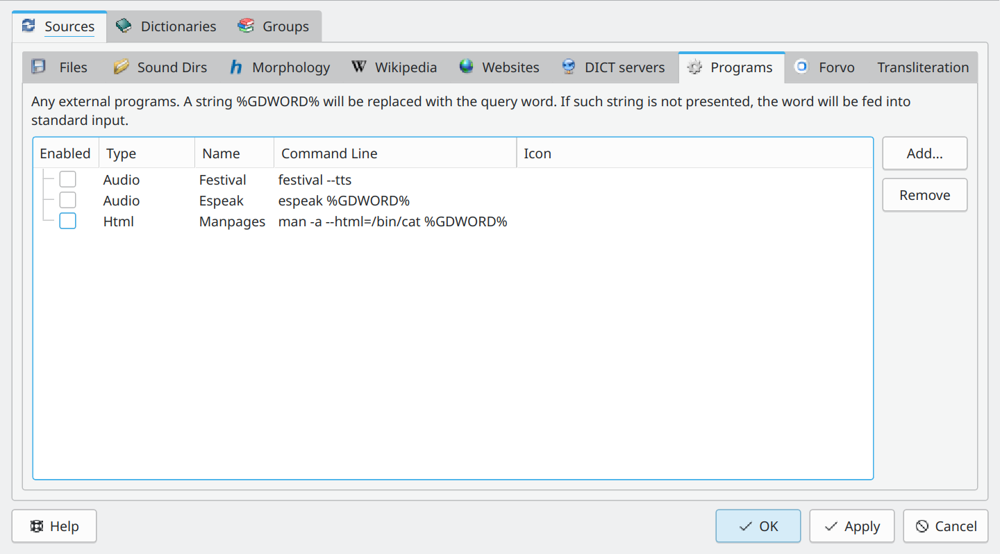
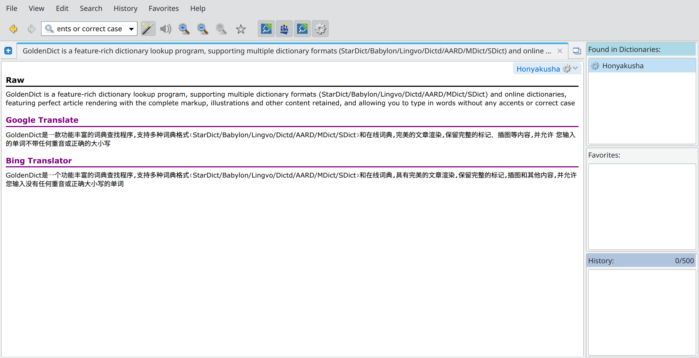

# Add Honyakusha to GoldenDict

### 1. Install Honyakusha according to [README.md](../../README.md)

### 2. Start GoldenDict

### 3. Open "Sources/Programs" dialog

### 3. Click "Add" button to add an external program

* Check the `Enabled` radio button
* Choose `Html` type
* Type `Honyakusha` into the `Name` text field
* Type **honyakusha trans --format=html %GDWORD%** into the `Command line` text field

### 4. Save and close the dialog

### 5. Translate text

